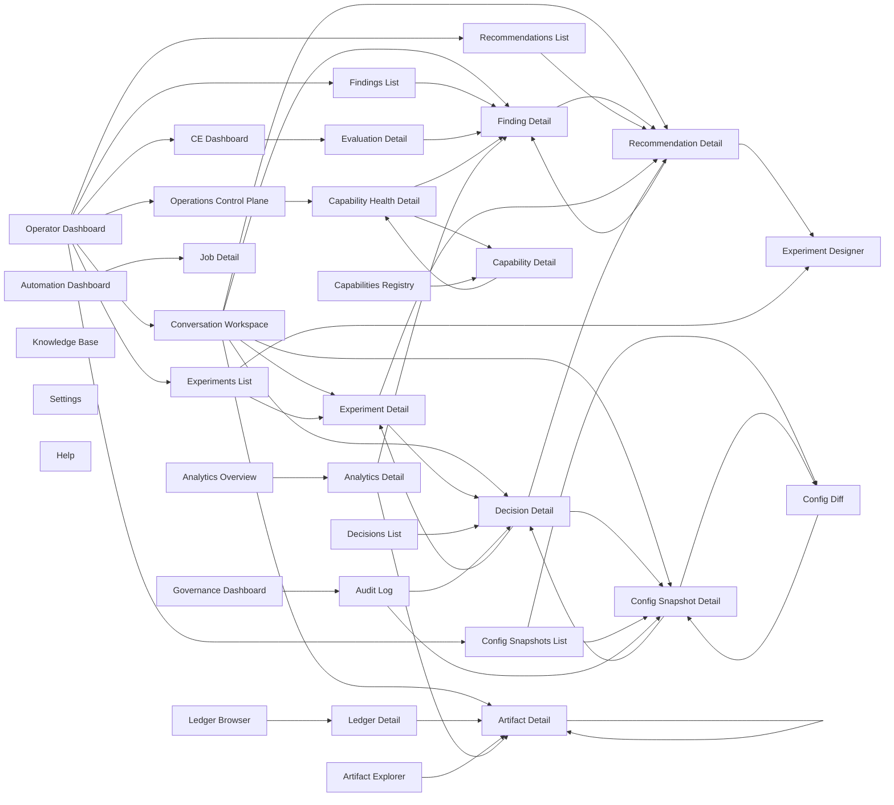

```mermaid
graph TD
    ROOT["/ — Operator Dashboard"]
    CONV["/conversation — Conversation Workspace"]

    subgraph Observe
        FINDINGS["/findings — Findings List"]
        FINDING["/findings/:id — Finding Detail"]
        CE["/evaluation — CE Dashboard"]
        CEDETAIL["/evaluation/:id — Evaluation Detail"]
    end

    subgraph Analyze
        RECS["/recommendations — Recommendations List"]
        REC["/recommendations/:id — Recommendation Detail"]
        EXPS["/experiments — Experiments List"]
        EXPDESIGN["/experiments/new — Experiment Designer"]
        EXP["/experiments/:id — Experiment Detail"]
        ANALYTICS["/analytics — Analytics Overview"]
        ANALCAT["/analytics/:category — Analytics Category Detail"]
    end

    subgraph Govern
        CONFIG["/configuration — Config Snapshots List"]
        CONFIGDETAIL["/configuration/:id — Config Snapshot Detail"]
        CONFIGDIFF["/configuration/diff — Config Diff"]
        DECISIONS["/decisions — Decisions List"]
        DECISION["/decisions/:id — Decision Detail"]
        GOV["/governance — Governance Dashboard"]
        AUDIT["/governance/audit — Audit Log"]
    end

    subgraph Operate
        OPS["/operations — Operations Control Plane"]
        OPSDETAIL["/operations/:capabilityId — Capability Health Detail"]
        AUTO["/automation — Automation Dashboard"]
        JOB["/automation/jobs/:id — Job Detail"]
        SCHED["/automation/schedules — Schedule Editor"]
        TRIG["/automation/triggers — Trigger Config"]
    end

    subgraph System
        CAPS["/capabilities — Capabilities Registry"]
        CAP["/capabilities/:id — Capability Detail"]
        LEDGER["/ledger — Learning Ledger Browser"]
        LEDGERDETAIL["/ledger/:id — Ledger Record Detail"]
    end

    subgraph Universal
        EXPLORER["/artifacts — Artifact Explorer"]
        ARTDETAIL["/artifacts/:id — Artifact Detail"]
        KNOWLEDGE["/knowledge — Knowledge Base"]
        SETTINGS["/settings — Profile & Preferences"]
        HELP["/help — Help & Documentation"]
    end

    ROOT --> CONV
    ROOT --> FINDINGS
    ROOT --> RECS
    ROOT --> EXPS
    ROOT --> CONFIG
    ROOT --> CE
    ROOT --> OPS

    CONV --> FINDING
    CONV --> REC
    CONV --> EXP
    CONV --> DECISION
    CONV --> CONFIGDETAIL
    CONV --> ARTDETAIL

    FINDINGS --> FINDING
    FINDING --> REC
    RECS --> REC
    REC --> EXPDESIGN
    REC --> FINDING
    EXPS --> EXP
    EXPS --> EXPDESIGN
    EXP --> DECISION
    EXP --> REC

    CONFIG --> CONFIGDETAIL
    CONFIGDETAIL --> CONFIGDIFF
    CONFIG --> CONFIGDIFF
    DECISIONS --> DECISION
    DECISION --> CONFIGDETAIL
    DECISION --> EXP
    DECISION --> REC

    CE --> CEDETAIL
    CEDETAIL --> FINDING

    OPS --> OPSDETAIL
    OPSDETAIL --> FINDING
    OPSDETAIL --> CAP

    AUTO --> JOB
    AUTO --> SCHED
    AUTO --> TRIG

    CAPS --> CAP
    CAP --> OPSDETAIL
    LEDGER --> LEDGERDETAIL

    ANALYTICS --> ANALCAT

    EXPLORER --> ARTDETAIL
    ARTDETAIL --> ARTDETAIL
```

# Screen Inventory

> Master inventory of every screen in the AI Engineering Platform.
> All screens map to backend capabilities and support the operator workflows defined in Phase 3.

---

## Module: Dashboard

### Screen: Operator Dashboard

- **Purpose**: Landing page giving operators an at-a-glance view of platform health, pending items, and recent activity.
- **Primary User**: AI Engineer, Platform Engineer, Engineering Manager
- **Route**: `/`
- **Navigation Location**: Sidebar — Home > Operator Dashboard
- **Parent Screen**: None (root)
- **Child Screens**: None (aggregates data from all modules)
- **Primary Actions**: Navigate to any pending item, view health summary, open daily brief
- **Secondary Actions**: Filter time window, customize widget layout
- **Data Displayed**: Health status per capability, pending findings count, pending recommendations count, active experiments, pending config snapshots, recent automation runs, daily brief summary, score trends
- **Entry Points**: Application root, logo click, sidebar "Dashboard" link
- **Exit Paths**: Click any widget item → drill into detail screen
- **Related Screens**: All module screens
- **Permissions**: View — all authenticated users
- **Empty State**: "No data yet. Complete your first evaluation to populate the dashboard."
- **Loading State**: Skeleton grid matching widget layout (5-6 skeleton cards)
- **Error State**: "Unable to load dashboard data. Check API connectivity." with retry button
- **Mobile Priority**: Low (operator sessions are desktop)

---

## Module: Operations — Findings

### Screen: Findings List

- **Purpose**: Browse, filter, and search all findings generated by the Evidence Engine and Continuous Evaluation.
- **Primary User**: AI Engineer, ML Engineer
- **Route**: `/findings`
- **Navigation Location**: Sidebar — Observe > Findings
- **Parent Screen**: None
- **Child Screens**: Finding Detail
- **Primary Actions**: Filter by severity/status/capability/time, search by keyword, acknowledge selected findings
- **Secondary Actions**: Export list, batch dismiss, sort by any column
- **Data Displayed**: Findings table (severity badge, title, affected capability, timestamp, status), filter bar, search input, pagination
- **Entry Points**: Sidebar link, Dashboard findings widget, notification click
- **Exit Paths**: Click row → Finding Detail, back to Dashboard
- **Related Screens**: Finding Detail, Recommendation Detail (if escalated)
- **Permissions**: View — all; Acknowledge/Dismiss — AI Engineer, ML Engineer
- **Empty State**: "All clear. No findings in the current time window."
- **Loading State**: Table skeleton with 8 rows, filter bar skeleton
- **Error State**: "Failed to load findings." with retry
- **Mobile Priority**: Medium (viewing list, but detail needs desktop)

### Screen: Finding Detail

- **Purpose**: Examine a single finding with full evidence timeline, lineage graph, and action controls.
- **Primary User**: AI Engineer
- **Route**: `/findings/:id`
- **Navigation Location**: Child of Findings List
- **Parent Screen**: Findings List
- **Child Screens**: None (may open Recommendation Detail as overlay)
- **Primary Actions**: Acknowledge, Dismiss (with reason), Escalate to Recommendation
- **Secondary Actions**: Share link, export evidence, view raw artifact
- **Data Displayed**: Finding title, severity, status, timestamp, evidence timeline (chronological observations), lineage graph (upstream traces/metrics, downstream recommendations), raw evidence payload, affected capability, model/config scope
- **Entry Points**: Click row in Findings List, notification deep link
- **Exit Paths**: Back to Findings List, navigate lineage graph nodes
- **Related Screens**: Findings List, Recommendation Detail (if escalated), Artifact Explorer
- **Permissions**: View — all; Acknowledge — AI Engineer; Dismiss — AI Engineer, ML Engineer; Escalate — AI Engineer
- **Empty State**: N/A (requires finding ID)
- **Loading State**: Detail panel skeleton with two-column layout placeholders
- **Error State**: "Finding not found or inaccessible." with back button
- **Mobile Priority**: Low (complex data visualization, lineage graph)

---

## Module: Operations — Recommendations

### Screen: Recommendations List

- **Purpose**: Browse, filter, and manage recommendations generated from findings.
- **Primary User**: AI Engineer, Engineering Manager
- **Route**: `/recommendations`
- **Navigation Location**: Sidebar — Analyze > Recommendations
- **Parent Screen**: None
- **Child Screens**: Recommendation Detail
- **Primary Actions**: Filter by status (Pending, Approved, Rejected, Draft, In Experiment), search, batch approve/reject
- **Secondary Actions**: Sort by confidence score, export list
- **Data Displayed**: Recommendations table (title, status badge, confidence score, source finding, created timestamp, owner), filter bar, search
- **Entry Points**: Sidebar link, Dashboard recommendations widget, notification
- **Exit Paths**: Click row → Recommendation Detail, back to Dashboard
- **Related Screens**: Recommendation Detail, Finding Detail (source), Experiments (if approved)
- **Permissions**: View — all; Approve/Reject — AI Engineer, Engineering Manager
- **Empty State**: "No recommendations yet. Findings need to be escalated first."
- **Loading State**: Table skeleton with 6 rows
- **Error State**: "Failed to load recommendations." with retry
- **Mobile Priority**: Medium

### Screen: Recommendation Detail

- **Purpose**: Evaluate a recommendation by reviewing its evidence, proposed change, risk assessment, and lineage.
- **Primary User**: AI Engineer
- **Route**: `/recommendations/:id`
- **Navigation Location**: Child of Recommendations List
- **Parent Screen**: Recommendations List
- **Child Screens**: None (opens Experiment Designer as overlay/modal)
- **Primary Actions**: Approve, Reject (with reason), Request Changes, Design Experiment
- **Secondary Actions**: Share link, compare before/after config, view source finding
- **Data Displayed**: Evidence summary, proposed change description, risk assessment panel, confidence score, lineage graph (finding → recommendation → experiment if exists), before/after config diff, comment thread
- **Entry Points**: Click row in Recommendations List, notification deep link
- **Exit Paths**: Back to Recommendations List, navigate to Finding Detail, open Experiment Designer
- **Related Screens**: Recommendations List, Finding Detail, Experiment Designer
- **Permissions**: View — all; Approve/Reject — AI Engineer, Engineering Manager; Request Changes — AI Engineer
- **Empty State**: N/A
- **Loading State**: Three-panel skeleton layout
- **Error State**: "Recommendation not found." with back button
- **Mobile Priority**: Low

---

## Module: Operations — Experiments

### Screen: Experiments List

- **Purpose**: Browse all experiment definitions and runs, filter by status, view results.
- **Primary User**: AI Engineer, ML Engineer
- **Route**: `/experiments`
- **Navigation Location**: Sidebar — Analyze > Experiments
- **Parent Screen**: None
- **Child Screens**: Experiment Detail, Experiment Designer
- **Primary Actions**: Filter by status (Draft, Running, Completed, Failed), search, launch new experiment
- **Secondary Actions**: Compare selected experiments, export results
- **Data Displayed**: Experiments table (name, status badge, variants count, duration, started timestamp, conclusion if completed), filter bar, search, "New Experiment" button
- **Entry Points**: Sidebar link, Dashboard experiments widget
- **Exit Paths**: Click row → Experiment Detail, click "New Experiment" → Experiment Designer
- **Related Screens**: Experiment Detail, Experiment Designer, Recommendation Detail (source)
- **Permissions**: View — all; Create/Launch — AI Engineer, ML Engineer
- **Empty State**: "No experiments yet. Approve a recommendation to get started."
- **Loading State**: Table skeleton with 5 rows
- **Error State**: "Failed to load experiments." with retry
- **Mobile Priority**: Medium

### Screen: Experiment Designer

- **Purpose**: Define a new experiment: configure variants, metrics, duration, and launch.
- **Primary User**: AI Engineer
- **Route**: `/experiments/new` or `/experiments/:id/edit`
- **Navigation Location**: Child of Experiments List (modal or full page)
- **Parent Screen**: Experiments List
- **Child Screens**: None
- **Primary Actions**: Add variant, configure metrics, set duration, set traffic allocation, Review & Launch, Save as Draft
- **Secondary Actions**: Cancel, load from recommendation, reset to defaults
- **Data Displayed**: Baseline config (auto-populated), variant editor, metric selector, duration slider, traffic split, rollback conditions editor, summary preview
- **Entry Points**: "New Experiment" button, Recommendation Detail → "Design Experiment" action
- **Exit Paths**: Launch → Experiment Detail (Running), Save Draft → Experiments List, Cancel → Experiments List
- **Related Screens**: Experiments List, Experiment Detail, Recommendation Detail
- **Permissions**: Create — AI Engineer, ML Engineer
- **Empty State**: N/A (form screen)
- **Loading State**: Form skeleton with config loader
- **Error State**: "Unable to load baseline configuration." with retry
- **Mobile Priority**: Low (complex form)

### Screen: Experiment Detail

- **Purpose**: View experiment status, metrics, results, and declare a winner.
- **Primary User**: AI Engineer, ML Engineer
- **Route**: `/experiments/:id`
- **Navigation Location**: Child of Experiments List
- **Parent Screen**: Experiments List
- **Child Screens**: None
- **Primary Actions**: View results, compare variants side-by-side, declare winner, stop experiment, view lineage
- **Secondary Actions**: Export results, share link, rerun
- **Data Displayed**: Experiment summary (name, status, duration, variants), metric comparison table (baseline vs candidate with delta and p-value), timeline chart (metrics over experiment duration), lineage links to source recommendation, statistical significance indicators, decision panel
- **Entry Points**: Click row in Experiments List, notification (experiment completed)
- **Exit Paths**: Back to Experiments List, navigate to DecisionCandidate (if winner declared), navigate to source recommendation
- **Related Screens**: Experiments List, Experiment Designer, Decision History, Recommendation Detail
- **Permissions**: View — all; Declare Winner — AI Engineer, ML Engineer; Stop — AI Engineer
- **Empty State**: N/A
- **Loading State**: Two-column skeleton with chart placeholder
- **Error State**: "Experiment not found or data unavailable." with back button
- **Mobile Priority**: Low

---

## Module: Operations — Decisions

### Screen: Decisions List

- **Purpose**: Browse the history of all decisions made (winner declarations, approvals, rejections).
- **Primary User**: Engineering Manager, AI Engineer
- **Route**: `/decisions`
- **Navigation Location**: Sidebar — Govern > Decisions (or nested under Govern)
- **Parent Screen**: None
- **Child Screens**: Decision Detail
- **Primary Actions**: Filter by type/status/time, search, export audit log
- **Secondary Actions**: View audit trail, filter by decision maker
- **Data Displayed**: Decisions table (type badge, title, source experiment/recommendation, decision maker, timestamp, status), filter bar, search
- **Entry Points**: Sidebar link, post-experiment flow
- **Exit Paths**: Click row → Decision Detail
- **Related Screens**: Decision Detail, Experiment Detail, Recommendation Detail, Config Snapshot Detail
- **Permissions**: View — all (audit trail)
- **Empty State**: "No decisions recorded yet."
- **Loading State**: Table skeleton with 6 rows
- **Error State**: "Failed to load decisions." with retry
- **Mobile Priority**: Medium

### Screen: Decision Detail

- **Purpose**: Examine a single decision with full audit context: who decided, why, and what changed.
- **Primary User**: Engineering Manager
- **Route**: `/decisions/:id`
- **Navigation Location**: Child of Decisions List
- **Parent Screen**: Decisions List
- **Child Screens**: None
- **Primary Actions**: View full audit trail, export decision record, navigate lineage
- **Secondary Actions**: None
- **Data Displayed**: Decision type, decision maker, timestamp, rationale text, source experiment/recommendation/config snapshot, lineage graph, approval chain
- **Entry Points**: Click row in Decisions List
- **Exit Paths**: Back to Decisions List, navigate to source artifact
- **Related Screens**: Decisions List, Experiment Detail, Recommendation Detail, Config Snapshot Detail
- **Permissions**: View — all (read-only)
- **Empty State**: N/A
- **Loading State**: Detail skeleton
- **Error State**: "Decision not found." with back button
- **Mobile Priority**: Low

---

## Module: Configuration

### Screen: Config Snapshots List

- **Purpose**: Browse all configuration snapshots, view current active config, manage pending approvals.
- **Primary User**: Platform Engineer, DevOps Engineer
- **Route**: `/configuration`
- **Navigation Location**: Sidebar — Govern > Configuration
- **Parent Screen**: None
- **Child Screens**: Config Snapshot Detail, Config Diff
- **Primary Actions**: Create new snapshot, view pending, view active, filter by status/date
- **Secondary Actions**: Compare two snapshots, view history timeline
- **Data Displayed**: Active config banner, pending approvals list, snapshot history table (version, status, created timestamp, author, linked recommendation/experiment), diff button
- **Entry Points**: Sidebar link, Dashboard config widget, notification (pending approval)
- **Exit Paths**: Click snapshot → Config Snapshot Detail, click diff → Config Diff
- **Related Screens**: Config Snapshot Detail, Config Diff, Decision Detail, Recommendation Detail
- **Permissions**: View — all; Create — Platform Engineer, DevOps Engineer; Approve — Engineering Manager
- **Empty State**: "No configuration snapshots yet. The system is running on defaults."
- **Loading State**: Table skeleton with active config skeleton card
- **Error State**: "Failed to load configuration data." with retry
- **Mobile Priority**: Medium

### Screen: Config Snapshot Detail

- **Purpose**: Review a specific snapshot: payload, lineage, approval status, and actions.
- **Primary User**: Platform Engineer, DevOps Engineer, Engineering Manager
- **Route**: `/configuration/:id`
- **Navigation Location**: Child of Config Snapshots List
- **Parent Screen**: Config Snapshots List
- **Child Screens**: Config Diff
- **Primary Actions**: Approve, Reject, Rollback to this snapshot, View Diff with current
- **Secondary Actions**: Export payload, view raw JSON
- **Data Displayed**: Snapshot metadata (version, status, timestamp, author), decision lineage (recommendation → experiment → decision), rollback plan, diff summary, raw payload viewer
- **Entry Points**: Click row in Config Snapshots List, notification link
- **Exit Paths**: Back to list, navigate to diff, navigate lineage nodes
- **Related Screens**: Config Snapshots List, Config Diff, Decision Detail
- **Permissions**: View — all; Approve/Reject — Engineering Manager; Rollback — Platform Engineer, DevOps Engineer
- **Empty State**: N/A
- **Loading State**: Detail skeleton with payload viewer placeholder
- **Error State**: "Snapshot not found." with back button
- **Mobile Priority**: Low

### Screen: Config Diff

- **Purpose**: Compare two configuration snapshots side-by-side or in unified diff view.
- **Primary User**: Platform Engineer, DevOps Engineer
- **Route**: `/configuration/diff` or `/configuration/diff/:idA/:idB`
- **Navigation Location**: Child of Config Snapshots List or Config Snapshot Detail
- **Parent Screen**: Config Snapshots List or Config Snapshot Detail
- **Child Screens**: None
- **Primary Actions**: Switch between side-by-side / unified diff, navigate to either snapshot
- **Secondary Actions**: Copy diff, export
- **Data Displayed**: Diff viewer (side-by-side or unified), file/key list with added/removed/changed indicators, line highlights
- **Entry Points**: "Compare" action on Config Snapshots List, "Diff with current" on Config Snapshot Detail
- **Exit Paths**: Back to Config Snapshots List, click snapshot version → Config Snapshot Detail
- **Related Screens**: Config Snapshots List, Config Snapshot Detail
- **Permissions**: View — all
- **Empty State**: N/A (requires two snapshots)
- **Loading State**: Diff skeleton with two-column placeholder
- **Error State**: "Unable to compute diff. One or both snapshots not found."
- **Mobile Priority**: Low

---

## Module: Continuous Evaluation

### Screen: CE Dashboard

- **Purpose**: View overall evaluation scores, trends, and breakdowns across capabilities.
- **Primary User**: AI Engineer, ML Engineer, Engineering Manager
- **Route**: `/evaluation`
- **Navigation Location**: Sidebar — Observe > Continuous Evaluation
- **Parent Screen**: None
- **Child Screens**: Evaluation Detail
- **Primary Actions**: Filter time window, compare windows, drill into capability score
- **Secondary Actions**: View raw report, export data
- **Data Displayed**: Overall score gauge, trend chart (score over last N windows), breakdown table by capability (score, change vs prior, trend indicator), latest report summary
- **Entry Points**: Sidebar link, Dashboard evaluation widget
- **Exit Paths**: Click capability → Evaluation Detail, click report → Report Detail
- **Related Screens**: Evaluation Detail, Findings List (findings generated during window)
- **Permissions**: View — all
- **Empty State**: "No evaluation data yet. The first evaluation will run automatically."
- **Loading State**: Chart skeleton with score gauge placeholder, table skeleton
- **Error State**: "Failed to load evaluation data." with retry
- **Mobile Priority**: Medium (read-only view)

### Screen: Evaluation Detail

- **Purpose**: Examine a single evaluation window's metrics per capability, generated findings, and raw report.
- **Primary User**: AI Engineer, ML Engineer
- **Route**: `/evaluation/:id` or `/evaluation/capability/:capId`
- **Navigation Location**: Child of CE Dashboard
- **Parent Screen**: CE Dashboard
- **Child Screens**: None
- **Primary Actions**: View findings generated, view raw report, compare with another window
- **Secondary Actions**: Export report
- **Data Displayed**: Full metric set for the capability, findings generated during this window, trend sparklines, raw report artifact link
- **Entry Points**: Click capability in CE Dashboard breakdown, click report link
- **Exit Paths**: Back to CE Dashboard, click finding → Finding Detail
- **Related Screens**: CE Dashboard, Finding Detail, Artifact Explorer (raw report)
- **Permissions**: View — all
- **Empty State**: N/A
- **Loading State**: Detail skeleton with chart placeholders
- **Error State**: "Evaluation data not found." with back button
- **Mobile Priority**: Low

---

## Module: Operations — Control Plane

### Screen: Operations Control Plane

- **Purpose**: Monitor health of all capabilities, view resource utilization, and drill into issues.
- **Primary User**: Platform Engineer, DevOps Engineer
- **Route**: `/operations`
- **Navigation Location**: Sidebar — Operate > Operations
- **Parent Screen**: None
- **Child Screens**: Capability Health Detail
- **Primary Actions**: View health matrix, filter by status, drill into capability, view recent incidents
- **Secondary Actions**: Refresh health status, view history
- **Data Displayed**: Capability health matrix (grid of all capabilities with green/yellow/red status), latency/error rate/throughput sparklines, recent events feed, resource utilization summary
- **Entry Points**: Sidebar link, Dashboard health panel
- **Exit Paths**: Click capability → Capability Health Detail
- **Related Screens**: Capability Health Detail, Automation History
- **Permissions**: View — Platform Engineer, DevOps Engineer
- **Empty State**: "No capabilities registered yet."
- **Loading State**: Health skeleton grid with 12 placeholder cards
- **Error State**: "Failed to load operations data." with retry
- **Mobile Priority**: Low (monitoring dashboard)

### Screen: Capability Health Detail

- **Purpose**: Deep-dive into a single capability's health metrics, recent artifacts, and related findings.
- **Primary User**: Platform Engineer
- **Route**: `/operations/:capabilityId`
- **Navigation Location**: Child of Operations Control Plane
- **Parent Screen**: Operations Control Plane
- **Child Screens**: None
- **Primary Actions**: View metrics over time, view recent artifacts, navigate to related findings
- **Secondary Actions**: Set alert thresholds, view runbooks
- **Data Displayed**: Health metrics charts (latency p50/p95/p99, error rate, throughput over time), recent artifacts list, related findings list, dependency graph (upstream/downstream capabilities)
- **Entry Points**: Click capability card in Operations Control Plane
- **Exit Paths**: Back to Operations Control Plane, click artifact → Artifact Explorer, click finding → Finding Detail
- **Related Screens**: Operations Control Plane, Artifact Explorer, Finding Detail
- **Permissions**: View — Platform Engineer, DevOps Engineer
- **Empty State**: N/A
- **Loading State**: Metric chart skeletons, artifact list skeleton
- **Error State**: "Capability not found or health data unavailable." with back button
- **Mobile Priority**: Low

---

## Module: Automation

### Screen: Automation Dashboard

- **Purpose**: View automation jobs, schedules, triggers, and run history.
- **Primary User**: DevOps Engineer, Platform Engineer
- **Route**: `/automation`
- **Navigation Location**: Sidebar — Operate > Automation
- **Parent Screen**: None
- **Child Screens**: Job Detail, Schedule Editor, Trigger Config
- **Primary Actions**: View history, run job manually, manage schedules, manage triggers
- **Secondary Actions**: View logs, export history
- **Data Displayed**: Recent job runs table (job type, status, started, duration, triggered by), schedule list, trigger list, health summary
- **Entry Points**: Sidebar link
- **Exit Paths**: Click job → Job Detail, click schedule → Schedule Editor, click trigger → Trigger Config
- **Related Screens**: Job Detail, Schedule Editor, Trigger Config, Operations Control Plane
- **Permissions**: View — all; Run/Edit — DevOps Engineer, Platform Engineer
- **Empty State**: "No automation jobs configured yet."
- **Loading State**: Dashboard skeleton with job history table placeholder
- **Error State**: "Failed to load automation data." with retry
- **Mobile Priority**: Low

### Screen: Job Detail

- **Purpose**: Examine a single automation job run: inputs, outputs, logs, and lineage.
- **Primary User**: DevOps Engineer
- **Route**: `/automation/jobs/:id`
- **Navigation Location**: Child of Automation Dashboard
- **Parent Screen**: Automation Dashboard
- **Child Screens**: None
- **Primary Actions**: View logs, rerun, view output artifacts
- **Secondary Actions**: Share link
- **Data Displayed**: Job metadata (type, status, started, duration, trigger), input parameters, output summary, logs (streamed), output artifacts list, lineage links
- **Entry Points**: Click job row in Automation Dashboard
- **Exit Paths**: Back to Automation Dashboard, navigate to output artifacts
- **Related Screens**: Automation Dashboard, Artifact Explorer (output artifacts)
- **Permissions**: View — all; Rerun — DevOps Engineer, Platform Engineer
- **Empty State**: N/A
- **Loading State**: Job detail skeleton with log viewer placeholder
- **Error State**: "Job not found." with back button
- **Mobile Priority**: Low

### Screen: Schedule Editor

- **Purpose**: View and manage automation schedules.
- **Primary User**: DevOps Engineer
- **Route**: `/automation/schedules`
- **Navigation Location**: Child of Automation Dashboard
- **Parent Screen**: Automation Dashboard
- **Child Screens**: None
- **Primary Actions**: Create schedule, edit schedule, enable/disable, delete
- **Secondary Actions**: Test schedule
- **Data Displayed**: Schedule list (name, cron expression, job type, enabled, last run, next run), create/edit form
- **Entry Points**: Automation Dashboard → Schedules tab
- **Exit Paths**: Back to Automation Dashboard
- **Related Screens**: Automation Dashboard, Trigger Config
- **Permissions**: View — all; Edit — DevOps Engineer, Platform Engineer
- **Empty State**: "No schedules configured. Automation relies on triggers only."
- **Loading State**: List skeleton
- **Error State**: "Failed to load schedules." with retry
- **Mobile Priority**: Low

### Screen: Trigger Config

- **Purpose**: View and manage automation triggers.
- **Primary User**: DevOps Engineer
- **Route**: `/automation/triggers`
- **Navigation Location**: Child of Automation Dashboard
- **Parent Screen**: Automation Dashboard
- **Child Screens**: None
- **Primary Actions**: Create trigger, edit trigger, enable/disable, delete
- **Secondary Actions**: Test trigger
- **Data Displayed**: Trigger list (name, condition, action, enabled, last fired), create/edit form
- **Entry Points**: Automation Dashboard → Triggers tab
- **Exit Paths**: Back to Automation Dashboard
- **Related Screens**: Automation Dashboard, Schedule Editor
- **Permissions**: View — all; Edit — DevOps Engineer, Platform Engineer
- **Empty State**: "No triggers configured."
- **Loading State**: List skeleton
- **Error State**: "Failed to load triggers." with retry
- **Mobile Priority**: Low

---

## Module: Capabilities

### Screen: Capabilities Registry

- **Purpose**: Browse all registered capabilities, their maturity, lifecycle stage, and dependencies.
- **Primary User**: Platform Engineer, Engineering Manager
- **Route**: `/capabilities`
- **Navigation Location**: Sidebar — System > Capabilities
- **Parent Screen**: None
- **Child Screens**: Capability Detail
- **Primary Actions**: Filter by lifecycle stage / maturity / owner, search, view dependency graph
- **Secondary Actions**: Export registry
- **Data Displayed**: Capability cards or table (name, description, lifecycle stage badge, maturity badge, owner, dependency count), filter bar, search, lifecycle stage group headers
- **Entry Points**: Sidebar link, Operations Control Plane
- **Exit Paths**: Click capability → Capability Detail
- **Related Screens**: Capability Detail, Operations Control Plane
- **Permissions**: View — all
- **Empty State**: "No capabilities registered."
- **Loading State**: Grid skeleton with 12 capability cards
- **Error State**: "Failed to load capabilities registry." with retry
- **Mobile Priority**: Medium

### Screen: Capability Detail

- **Purpose**: Examine a single capability: its definition, dependencies, artifacts, health, and maturity.
- **Primary User**: Platform Engineer
- **Route**: `/capabilities/:id`
- **Navigation Location**: Child of Capabilities Registry
- **Parent Screen**: Capabilities Registry
- **Child Screens**: None
- **Primary Actions**: View dependency graph, view artifacts produced, navigate to operations health
- **Secondary Actions**: Edit maturity (admin), view API docs
- **Data Displayed**: Capability metadata (id, name, description, owner, lifecycle stage, maturity), dependency list (upstream/downstream), artifacts produced list, health link to Operations, API prefix
- **Entry Points**: Click capability in Capabilities Registry
- **Exit Paths**: Back to Capabilities Registry, navigate to dependency capabilities, navigate to Operations health
- **Related Screens**: Capabilities Registry, Operations Control Plane, Artifact Explorer
- **Permissions**: View — all; Edit maturity — Platform Engineer (admin)
- **Empty State**: N/A
- **Loading State**: Detail skeleton with dependency graph placeholder
- **Error State**: "Capability not found." with back button
- **Mobile Priority**: Low

---

## Module: Learning Ledger

### Screen: Learning Ledger Browser

- **Purpose**: Browse raw learning records stored in the ledger — the foundational data layer.
- **Primary User**: ML Engineer, Platform Engineer
- **Route**: `/ledger`
- **Navigation Location**: Sidebar — System > Learning Ledger
- **Parent Screen**: None
- **Child Screens**: Ledger Record Detail
- **Primary Actions**: Filter by event type / time / user, search, export
- **Secondary Actions**: View statistics
- **Data Displayed**: Ledger records table (id, event type, user, timestamp, summary), filter bar, search, pagination, stats summary
- **Entry Points**: Sidebar link
- **Exit Paths**: Click record → Ledger Record Detail
- **Related Screens**: Ledger Record Detail, Artifact Explorer
- **Permissions**: View — Platform Engineer, ML Engineer (read-only)
- **Empty State**: "No learning records yet."
- **Loading State**: Table skeleton with 10 rows
- **Error State**: "Failed to load ledger data." with retry
- **Mobile Priority**: Low

### Screen: Ledger Record Detail

- **Purpose**: Examine a single learning record with full payload and lineage.
- **Primary User**: ML Engineer, Platform Engineer
- **Route**: `/ledger/:id`
- **Navigation Location**: Child of Learning Ledger Browser
- **Parent Screen**: Learning Ledger Browser
- **Child Screens**: None
- **Primary Actions**: View raw payload, navigate lineage
- **Secondary Actions**: Export record
- **Data Displayed**: Record metadata (id, event type, user, timestamp), raw JSON payload, lineage links
- **Entry Points**: Click record in Learning Ledger Browser
- **Exit Paths**: Back to Learning Ledger Browser, navigate to related artifacts
- **Related Screens**: Learning Ledger Browser, Artifact Explorer
- **Permissions**: View — Platform Engineer, ML Engineer
- **Empty State**: N/A
- **Loading State**: Detail skeleton with JSON viewer placeholder
- **Error State**: "Record not found." with back button
- **Mobile Priority**: Low

---

## Module: Artifact Explorer

### Screen: Artifact Explorer

- **Purpose**: Universal browser for all artifact types across the platform — search, filter, inspect, and navigate lineage.
- **Primary User**: AI Engineer, Platform Engineer, Engineering Manager
- **Route**: `/artifacts`
- **Navigation Location**: Sidebar — Home > Artifact Explorer
- **Parent Screen**: None
- **Child Screens**: Artifact Detail
- **Primary Actions**: Search by keyword/ID, filter by type/capability/date/status, navigate lineage
- **Secondary Actions**: Export artifact, share link
- **Data Displayed**: Search bar (prominent), filter panel (type, capability, date range, status), paginated results list (summary cards), result count
- **Entry Points**: Sidebar link, global search "view all results", lineage navigation from any screen
- **Exit Paths**: Click artifact → Artifact Detail, navigate lineage from results
- **Related Screens**: Artifact Detail, all detail screens (finding, recommendation, experiment, etc.)
- **Permissions**: View — all
- **Empty State**: "No artifacts found matching your search."
- **Loading State**: Search bar with results skeleton
- **Error State**: "Search failed. Check your query and try again." with retry
- **Mobile Priority**: High (search is universal)

### Screen: Artifact Detail

- **Purpose**: Inspect a single artifact — its metadata, raw payload, and full lineage graph.
- **Primary User**: AI Engineer, Platform Engineer
- **Route**: `/artifacts/:id`
- **Navigation Location**: Child of Artifact Explorer
- **Parent Screen**: Artifact Explorer
- **Child Screens**: None (navigates to other artifact details via lineage)
- **Primary Actions**: View raw payload, navigate parents/children via lineage graph, copy ID, export
- **Secondary Actions**: Share link
- **Data Displayed**: Artifact metadata (id, type, version, timestamp, capability), lineage graph (interactive DAG — parents upstream, children downstream), raw payload viewer (formatted JSON with syntax highlighting)
- **Entry Points**: Click artifact in Artifact Explorer, lineage navigation from any screen
- **Exit Paths**: Back to Artifact Explorer, click parent/child → their Artifact Detail
- **Related Screens**: Artifact Explorer, all detail screens (shared lineage navigation)
- **Permissions**: View — all
- **Empty State**: N/A
- **Loading State**: Detail skeleton with lineage graph placeholder
- **Error State**: "Artifact not found." with back button, "Artifact payload exceeds display size" with download option
- **Mobile Priority**: Low (complex DAG visualization)

---

## Module: Analytics

### Screen: Analytics Overview

- **Purpose**: View aggregate analytics across queries, retrieval, routing, behavior, and trends.
- **Primary User**: AI Engineer, ML Engineer
- **Route**: `/analytics`
- **Navigation Location**: Sidebar — Analyze > Analytics (or embedded in Observe)
- **Parent Screen**: None
- **Child Screens**: Query Analytics, Retrieval Analytics, Routing Analytics, Behavior Analytics, Trend Analytics
- **Primary Actions**: Select analytics category, filter time window, export
- **Secondary Actions**: Compare periods
- **Data Displayed**: Overview dashboard with summary cards per analytics category, trend sparklines, top-level KPIs
- **Entry Points**: Sidebar link
- **Exit Paths**: Click category → category detail screen
- **Related Screens**: Query Analytics, Retrieval Analytics, Routing Analytics, Behavior Analytics, Trend Analytics, CE Dashboard
- **Permissions**: View — all
- **Empty State**: "Analytics data will appear once the system processes user interactions."
- **Loading State**: Summary card skeleton grid
- **Error State**: "Failed to load analytics." with retry
- **Mobile Priority**: Medium

### Screen: Analytics Category Detail

- **Purpose**: Deep-dive into a specific analytics category (query patterns, retrieval effectiveness, routing accuracy, user behavior, or trends).
- **Primary User**: AI Engineer, ML Engineer
- **Route**: `/analytics/query`, `/analytics/retrieval`, `/analytics/routing`, `/analytics/behavior`, `/analytics/trends`
- **Navigation Location**: Child of Analytics Overview
- **Parent Screen**: Analytics Overview
- **Child Screens**: None
- **Primary Actions**: Filter by metric, time window, segment; export chart data; drill into data points
- **Secondary Actions**: Compare segments, view raw data table
- **Data Displayed**: Category-specific charts (bar, line, distribution), data table, filter bar, time window selector
- **Entry Points**: Click category card in Analytics Overview
- **Exit Paths**: Back to Analytics Overview
- **Related Screens**: Analytics Overview, Evidence Engine (if drilling into retrieval effectiveness)
- **Permissions**: View — all
- **Empty State**: "No data for this analytics category in the selected time window."
- **Loading State**: Chart skeleton with filter bar placeholder
- **Error State**: "Failed to load analytics category data." with retry
- **Mobile Priority**: Low

---

## Module: Knowledge Base (Documents)

### Screen: Knowledge Base

- **Purpose**: Manage uploaded documents for RAG — upload, list, delete, view chunk details.
- **Primary User**: AI Engineer, ML Engineer
- **Route**: `/knowledge`
- **Navigation Location**: Sidebar — Data > Knowledge Base (or similar)
- **Parent Screen**: None
- **Child Screens**: None (may open upload modal)
- **Primary Actions**: Upload document, delete document, view chunk details, filter by type
- **Secondary Actions**: Search within documents, view indexing status
- **Data Displayed**: Document list (filename, type, chunk count, upload timestamp), upload button, supported types info, index status banner
- **Entry Points**: Sidebar link
- **Exit Paths**: Click document → view chunk details inline or modal
- **Related Screens**: Analytics — Retrieval Analytics (document effectiveness)
- **Permissions**: Upload/Delete — AI Engineer, ML Engineer; View — all
- **Empty State**: "No documents uploaded. Upload PDF, TXT, or MD files to populate the knowledge base."
- **Loading State**: Table skeleton with 5 rows
- **Error State**: "Failed to load documents." with retry
- **Mobile Priority**: Medium

---

## Module: Governance

### Screen: Governance Dashboard

- **Purpose**: View governance policies, compliance status, and audit log.
- **Primary User**: Engineering Manager
- **Route**: `/governance`
- **Navigation Location**: Sidebar — Govern > Governance
- **Parent Screen**: None
- **Child Screens**: Policy Detail, Audit Log
- **Primary Actions**: View policies, view audit log, check compliance status
- **Secondary Actions**: Export audit log
- **Data Displayed**: Policy list with compliance status, audit log summary, compliance score, pending review items
- **Entry Points**: Sidebar link
- **Exit Paths**: Click policy → Policy Detail, click audit entry → Audit Log
- **Related Screens**: Audit Log, Decisions List, Config Snapshots List
- **Permissions**: View — all; Edit policies — Engineering Manager (admin)
- **Empty State**: "Governance policies will be configured during platform setup."
- **Loading State**: Dashboard skeleton
- **Error State**: "Failed to load governance data." with retry
- **Mobile Priority**: Low

### Screen: Audit Log

- **Purpose**: View a chronological audit trail of all platform actions.
- **Primary User**: Engineering Manager, Platform Engineer
- **Route**: `/governance/audit`
- **Navigation Location**: Child of Governance Dashboard
- **Parent Screen**: Governance Dashboard
- **Child Screens**: None
- **Primary Actions**: Filter by action type / user / date range, search, export
- **Secondary Actions**: View detail for specific entry
- **Data Displayed**: Audit log table (timestamp, user, action type, resource, detail), filter bar, search, pagination
- **Entry Points**: Governance Dashboard → Audit Log
- **Exit Paths**: Back to Governance Dashboard
- **Related Screens**: Governance Dashboard, Decisions List
- **Permissions**: View — Engineering Manager, Platform Engineer
- **Empty State**: "No audit entries recorded yet."
- **Loading State**: Table skeleton with 10 rows
- **Error State**: "Failed to load audit log." with retry
- **Mobile Priority**: Low

---

## Module: User Settings

### Screen: Profile & Preferences

- **Purpose**: Manage user profile, notification preferences, theme, and keyboard shortcuts.
- **Primary User**: All users
- **Route**: `/settings`
- **Navigation Location**: User menu dropdown > Settings
- **Parent Screen**: None
- **Child Screens**: None
- **Primary Actions**: Update profile, toggle dark mode, configure notification preferences, view keyboard shortcuts
- **Secondary Actions**: Sign out, view API tokens
- **Data Displayed**: Profile form, theme toggle (light/dark/system), notification preference checkboxes, keyboard shortcut reference table, API token management
- **Entry Points**: User menu → Settings
- **Exit Paths**: Close settings, navigate away
- **Related Screens**: None
- **Permissions**: Own profile only
- **Empty State**: N/A (form screen)
- **Loading State**: Form skeleton
- **Error State**: "Failed to load settings." with retry
- **Mobile Priority**: High

---

## Module: Help

### Screen: Help & Documentation

- **Purpose**: Access platform documentation, keyboard shortcuts reference, and support.
- **Primary User**: All users
- **Route**: `/help`
- **Navigation Location**: User menu > Help, or sidebar bottom
- **Parent Screen**: None
- **Child Screens**: None
- **Primary Actions**: Search docs, view shortcut reference, view release notes
- **Secondary Actions**: Contact support
- **Data Displayed**: Documentation search, categorized help articles, keyboard shortcut reference, release notes, version info
- **Entry Points**: User menu → Help, sidebar link, "?" icon in top bar
- **Exit Paths**: Close help
- **Related Screens**: None
- **Permissions**: All users
- **Empty State**: N/A
- **Loading State**: Search bar with article list skeleton
- **Error State**: "Help content unavailable." with retry
- **Mobile Priority**: Medium

---

## Module: Notifications

### Screen: Notification Panel

- **Purpose**: View recent notifications and navigate to the relevant item.
- **Primary User**: All users
- **Route**: (Slide-over panel, not a full page)
- **Navigation Location**: Top bar notification bell
- **Parent Screen**: None (overlay on any screen)
- **Child Screens**: None
- **Primary Actions**: Click notification → navigate to item, mark as read, clear all
- **Secondary Actions**: View all notifications
- **Data Displayed**: Notification list (icon, title, timestamp, read/unread), grouped by date, "View all" link
- **Entry Points**: Click bell icon in top bar
- **Exit Paths**: Click notification (navigates away), click outside (closes panel)
- **Related Screens**: All detail screens (navigated to from notifications)
- **Permissions**: Own notifications only
- **Empty State**: "No notifications."
- **Loading State**: Notification list skeleton
- **Error State**: (silent failure — badge updates on next poll)
- **Mobile Priority**: High

---

## Module: Search

### Screen: Global Search (Command Palette)

- **Purpose**: Universal search across all artifact types, capabilities, configs, and users.
- **Primary User**: All users
- **Route**: (Overlay modal, not a full page)
- **Navigation Location**: Triggered by ⌘K or clicking search bar
- **Parent Screen**: None (overlay on any screen)
- **Child Screens**: None
- **Primary Actions**: Search by keyword, navigate to result, filter by type prefix
- **Secondary Actions**: Recent searches, recent artifacts
- **Data Displayed**: Search input (auto-focused), results grouped by artifact type, recent searches, recent artifacts, keyboard shortcut hints
- **Entry Points**: ⌘K / Ctrl+K, click top bar search
- **Exit Paths**: Escape (closes), Enter on result (navigates)
- **Related Screens**: Artifact Explorer, all detail screens
- **Permissions**: All users
- **Empty State**: "Type to search artifacts, capabilities, and configs."
- **Loading State**: Spinner with "Searching..." text
- **Error State**: (inline — "Search failed. Try again." within palette)
- **Mobile Priority**: High

---

## Module: Conversation

### Screen: Conversation Workspace

- **Purpose**: Primary AI interaction surface — conversational interface with supporting context panels for artifacts, lineage, and tools.
- **Primary User**: All users
- **Route**: `/conversation` (default: `/`)
- **Navigation Location**: Sidebar — Home > OwnGPT, or default landing page
- **Parent Screen**: None (root)
- **Child Screens**: None (artifacts open in Context Panel or navigate to detail screens)
- **Primary Actions**: Send message, review AI response, invoke tool, approve/reject, attach file, search history
- **Secondary Actions**: Toggle context panel, toggle split view, export conversation, branch conversation
- **Data Displayed**: Message thread (user + AI messages), streaming response, artifact cards, tool results, evidence blocks, approval requests, follow-up suggestions, context panel (artifact preview, tool output, lineage)
- **Entry Points**: Default landing page, sidebar link, notification click, global search
- **Exit Paths**: Navigate to detail screen via artifact click, open in split view with OwnOps
- **Related Screens**: All detail screens (artifact navigation), OwnOps (split view)
- **Permissions**: All authenticated users
- **Empty State**: Welcome message with suggested starting points (first-time) or restored last conversation (returning)
- **Loading State**: Thread skeleton with 3 placeholder message blocks
- **Error State**: "Failed to load conversation" with retry; errors within thread shown inline
- **Mobile Priority**: High (primary interface)

---



---

## Route Hierarchy

```
/                                       Operator Dashboard
├── /conversation                       Conversation Workspace
├── /findings                           Findings List
│   └── /findings/:id                   Finding Detail
├── /recommendations                    Recommendations List
│   └── /recommendations/:id            Recommendation Detail
├── /experiments                        Experiments List
│   ├── /experiments/new                Experiment Designer
│   └── /experiments/:id                Experiment Detail
├── /decisions                          Decisions List
│   └── /decisions/:id                  Decision Detail
├── /configuration                      Config Snapshots List
│   ├── /configuration/:id              Config Snapshot Detail
│   └── /configuration/diff             Config Diff
├── /evaluation                         CE Dashboard
│   └── /evaluation/:id                 Evaluation Detail
├── /operations                         Operations Control Plane
│   └── /operations/:capabilityId       Capability Health Detail
├── /automation                         Automation Dashboard
│   ├── /automation/jobs/:id            Job Detail
│   ├── /automation/schedules           Schedule Editor
│   └── /automation/triggers            Trigger Config
├── /capabilities                       Capabilities Registry
│   └── /capabilities/:id               Capability Detail
├── /ledger                             Learning Ledger Browser
│   └── /ledger/:id                     Ledger Record Detail
├── /artifacts                          Artifact Explorer
│   └── /artifacts/:id                  Artifact Detail
├── /analytics                          Analytics Overview
│   └── /analytics/:category            Analytics Category Detail
├── /knowledge                          Knowledge Base
├── /settings                           Profile & Preferences
└── /help                               Help & Documentation
```

---

## Navigation Depth Analysis

| Depth | Screens |
|---|---|---|
| Level 0 (root) | Operator Dashboard |
| Level 1 (list/index) | Conversation Workspace, Findings List, Recommendations List, Experiments List, Decisions List, Config Snapshots List, CE Dashboard, Operations Control Plane, Automation Dashboard, Capabilities Registry, Learning Ledger Browser, Artifact Explorer, Analytics Overview, Knowledge Base, Governance Dashboard |
| Level 2 (detail) | Finding Detail, Recommendation Detail, Experiment Detail, Experiment Designer, Decision Detail, Config Snapshot Detail, Config Diff, Evaluation Detail, Capability Health Detail, Job Detail, Schedule Editor, Trigger Config, Capability Detail, Ledger Record Detail, Artifact Detail, Analytics Category Detail, Audit Log |
| Level 3+ | None |

**Maximum depth: 2 levels below root (3 total including root).** This satisfies the ≤3 levels constraint.

---

## Screen Dependency Graph



---

## Recommended Implementation Order

| Order | Screen | Complexity | Depends On | MVP |
|---|---|---|---|---|
| 1 | Operator Dashboard | High | All modules (aggregates data) | Yes |
| 2 | Conversation Workspace | High | AI Engine, all artifact APIs | Yes |
| 3 | Findings List | Medium | Evidence Engine API | Yes |
| 4 | Finding Detail | Medium | Evidence Engine API | Yes |
| 5 | Recommendations List | Medium | Recommendation Engine API | Yes |
| 6 | Recommendation Detail | Medium | Recommendation Engine API | Yes |
| 7 | Experiment Designer | High | Experimentation API | Yes |
| 8 | Experiment Detail | High | Experimentation API | Yes |
| 9 | Config Snapshots List | Medium | Config Management API | Yes |
| 10 | Config Snapshot Detail | Medium | Config Management API | Yes |
| 11 | Config Diff | Medium | Config Management API | Yes |
| 12 | Decisions List | Low | Operations API | Yes |
| 13 | Decision Detail | Low | Operations API | Yes |
| 14 | CE Dashboard | Medium | Automation API | Yes |
| 15 | Evaluation Detail | Low | Automation API | Yes |
| 16 | Operations Control Plane | Medium | Operations API | Yes |
| 17 | Capability Health Detail | Low | Operations API | Yes |
| 18 | Automation Dashboard | Medium | Automation API | V2 |
| 19 | Job Detail | Low | Automation API | V2 |
| 20 | Schedule Editor | Low | Automation API | V2 |
| 21 | Trigger Config | Low | Automation API | V2 |
| 22 | Capabilities Registry | Low | Capability Registry API | V2 |
| 23 | Capability Detail | Low | Capability Registry API | V2 |
| 24 | Learning Ledger Browser | Low | Learning Ledger API | V2 |
| 25 | Ledger Record Detail | Low | Learning Ledger API | V2 |
| 26 | Artifact Explorer | Medium | All artifact APIs | V2 |
| 27 | Artifact Detail | Medium | All artifact APIs | V2 |
| 28 | Analytics Overview | Medium | Analytics API | V2 |
| 29 | Analytics Category Detail | Low | Analytics API | V2 |
| 30 | Knowledge Base | Low | Documents API | V2 |
| 31 | Governance Dashboard | Low | Governance | V2 |
| 32 | Audit Log | Low | Governance | V2 |
| 33 | Profile & Preferences | Low | Auth | Yes |
| 34 | Help & Documentation | Low | Static | V2 |
| 35 | Notification Panel | Medium | Notification system | V2 |
| 36 | Global Search Palette | High | All artifact APIs | V2 |

---

## Complexity Summary

| Complexity | Count | Screens |
|---|---|---|
| High | 6 | Dashboard, Conversation Workspace, Experiment Designer, Experiment Detail, Config Diff, Global Search |
| Medium | 16 | Findings List/Detail, Recommendations List/Detail, Config Lists, CE Dashboard, Operations CP, Automation Dashboard, Artifact Explorer/Detail, Analytics Overview, Notification Panel, Decisions screens |
| Low | 14 | Decision Detail, Evaluation Detail, Health Detail, Jobs/Schedules/Triggers, Capabilities/Ledger screens, Analytics Detail, KB, Governance/Audit, Settings, Help |

---

## MVP Screens (Must Ship)

1. Operator Dashboard
2. Conversation Workspace
3. Findings List + Detail
4. Recommendations List + Detail
5. Experiment Designer + Detail
6. Decisions List + Detail
7. Config Snapshots List + Detail + Diff
8. CE Dashboard + Evaluation Detail
9. Operations Control Plane + Health Detail
10. Profile & Preferences

## V2 Screens (Post-Launch)

1. Automation Dashboard + Job Detail + Schedules + Triggers
2. Capabilities Registry + Detail
3. Learning Ledger Browser + Detail
4. Artifact Explorer + Detail
5. Analytics Overview + Category Details
6. Knowledge Base
7. Governance Dashboard + Audit Log
8. Help & Documentation
9. Notification Panel
10. Global Search Palette
