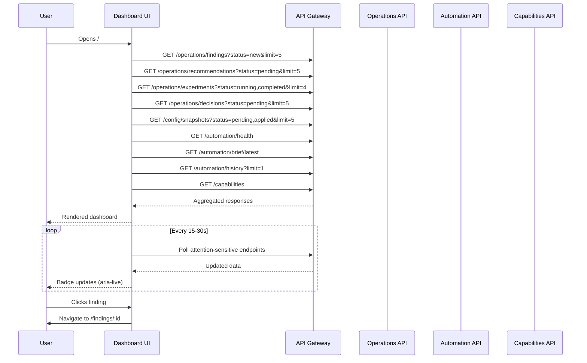

# Dashboard Information Architecture

> Operator Dashboard — the command center for the AI Engineering Platform.
>
> Answers in 30 seconds: **"What needs my attention right now?"**

---

## Dashboard Design Principles

### 1. Action before information
Every widget must lead to an action. If a widget does not drive a decision or navigation, it does not belong on the dashboard.

### 2. Alerts before charts
Anything requiring human intervention sits above any historical or trend data. Attention items first. Context second.

### 3. Health before history
Current platform health status is always visible above the fold. Historical trends are secondary and scrollable.

### 4. One-click drill down
Every widget item is clickable and navigates directly to the relevant detail screen. Never force the user to search for the destination.

### 5. Minimal cognitive load
Never show more than 7 actionable items in a single widget. Use badges and counts, not paragraphs. Engineers scan; they don't read dashboard content.

### 6. Progressive disclosure
Surface counts and severity. Reveal details on interaction. Never show raw data on the dashboard.

### 7. Consistent widget behavior
Every card follows the same pattern: header (title + count badge + action link) → content list → optional footer.

### 8. Time-boxed default view
Default time window is "last 24 hours" with quick presets: 24h, 7d, 30d. The dashboard always defaults to the most recent complete evaluation window.

### 9. State preservation
Scrolling position, expanded sections, and time window persist across navigation and page refresh within the session.

### 10. Keyboard-first
All widget interactions are reachable via keyboard. Tab order follows visual hierarchy (top-to-bottom, left-to-right).

---

## Global Layout Hierarchy

```
┌──────────────────────────────────────────────────────────────┐
│ ┌─────────────────────────────────────────────────────────┐ │
│ │  Global Command Bar  (fixed top, full width)            │ │
│ └─────────────────────────────────────────────────────────┘ │
├──────────────────────────────────────────────────────────────┤
│ ┌─────────────────────────┬─────────────────────────────────┐│
│ │                         │  Zone B (right column)          ││
│ │  Zone A (left column)   │                                 ││
│ │                         │  B1: Daily Brief                ││
│ │  A1: Platform Health    │  B2: Recent Config Changes      ││
│ │      Summary            │  B3: Automation Status          ││
│ │                         │  B4: Recent Activity Timeline   ││
│ │  A2: Attention Queue    │                                 ││
│ │                         │                                 ││
│ │  A3: Critical Findings  │                                 ││
│ │                         │                                 ││
│ │  A4: Pending            │                                 ││
│ │      Recommendations    │                                 ││
│ │                         │                                 ││
│ │  A5: Running            │                                 ││
│ │      Experiments        │                                 ││
│ │                         │                                 ││
│ │  A6: Decision Queue     │                                 ││
│ │                         │                                 ││
│ │  A7: Health Trends      │                                 ││
│ └─────────────────────────┴─────────────────────────────────┘│
├──────────────────────────────────────────────────────────────┤
│ ┌─────────────────────────────────────────────────────────┐ │
│ │  Capability Status  (full width, below fold)            │ │
│ └─────────────────────────────────────────────────────────┘ │
└──────────────────────────────────────────────────────────────┘
```

### Zone allocation
| Zone | Width | Purpose |
|---|---|---|
| A (left column) | 65% | Primary attention-driving content |
| B (right column) | 35% | Summary, context, and history |
| Full-width bottom | 100% | System overview (scrolled to) |

### Above the fold contents
1. Global Command Bar (always visible)
2. Platform Health Summary (Zone A, top)
3. Daily Brief (Zone B, top)
4. Attention Queue (Zone A, immediately below health)

### Below the fold
- Critical Findings, Recommendations, Experiments, Decisions (Zone A)
- Config Changes, Automation, Activity (Zone B)
- Capability Status (full-width bottom)

---

## Section Definitions

---

### Section 1: Global Command Bar

**Purpose**: Persistent top bar providing global search, time window control, and quick actions regardless of scroll position.

**Priority**: P0 (always visible, sticky)

**Data Source**: Client-side (search triggers artifact API on input)

**Primary User**: All users

**Displayed Information**:
- Search input with placeholder "Search artifacts, capabilities, configs... (⌘K)"
- Time window selector (dropdown: 24h / 7d / 30d / custom)
- Quick action button ("+")
- Notification bell with unread count
- User avatar / menu

**Possible User Actions**:
- Type to search (opens command palette)
- Switch time window (refreshes all dashboard widgets)
- Open quick actions menu
- View notifications
- Access user menu (settings, sign out)

**Navigation Targets**: `⌘K` opens search overlay; notification click opens slide-over panel; quick action opens create menu

**Refresh Frequency**: Static (search is live; time window triggers full refresh)

**Empty State**: N/A

**Loading State**: N/A

**Error State**: N/A

**Future Enhancements**: Saved searches, recent searches dropdown, global status indicator

---

### Section 2: Platform Health Summary

**Purpose**: Immediate answer to "Is the platform healthy?" — a compact row of capability health indicators.

**Priority**: P0 (top of left column, above the fold)

**Data Source**: `GET /api/v1/operations` (health summary) or `GET /api/v1/automation/health`

**Primary User**: Platform Engineer, DevOps Engineer, all users

**Displayed Information**:
- Row of capability health pills/badges: each shows capability name + status dot (green/yellow/red)
- Total count: "X of Y healthy"
- Color-coded by worst status

**Possible User Actions**:
- Click any capability pill → navigate to Capability Health Detail
- Click "X of Y healthy" → navigate to Operations Control Plane

**Navigation Targets**: `/operations/:capabilityId`, `/operations`

**Refresh Frequency**: Every 30 seconds (polling)

**Empty State**: "No capabilities registered."

**Loading State**: Row of skeleton pills (12 placeholders)

**Error State**: "Unable to reach health endpoint." — all pills show gray/unknown with click to retry

**Future Enhancements**: Animated pulse for degraded capabilities, sparkline on hover

---

### Section 3: Attention Queue

**Purpose**: Aggregated feed of every item requiring human action — findings, recommendations, pending approvals — in a single unified list sorted by urgency.

**Priority**: P0 (immediately below Platform Health, above the fold)

**Data Source**: Aggregated from `GET /api/v1/operations/findings`, `/operations/recommendations`, `/config/snapshots` (pending), `/automation/health`

**Primary User**: AI Engineer, Engineering Manager

**Displayed Information**:
- Unified list of actionable items (max 7)
- Each item shows: icon (type), title text, severity badge, timestamp, 1-line summary
- Items sorted by: critical severity first, then by recency
- Header shows total count: "X items need attention"

**Possible User Actions**:
- Click item → navigate to its detail screen
- Click "View all" → navigate to the relevant list screen based on item type
- Acknowledge item inline (dismiss from queue without navigating away)

**Navigation Targets**: `/findings/:id`, `/recommendations/:id`, `/experiments/:id`, `/configuration/:id`, `/decisions/:id`

**Refresh Frequency**: Every 15 seconds (polling) — highest refresh rate of any widget

**Empty State**: "No items need attention. All clear." with checkmark icon

**Loading State**: Skeleton list with 5 rows

**Error State**: "Unable to load attention queue." with retry link

**Future Enhancements**: User-specific filtering (show only items assigned to or relevant to current user), snooze, mark as reviewed

---

### Section 4: Daily Brief

**Purpose**: AI-generated natural language summary of what happened since yesterday — key changes, notable findings, experiment conclusions, and config changes.

**Priority**: P0 (top of right column, above the fold)

**Data Source**: `GET /api/v1/automation/brief/latest`

**Primary User**: AI Engineer, Engineering Manager

**Displayed Information**:
- Brief header with date
- 3-5 bullet points covering: new findings count, experiments completed, config changes applied, notable metric changes
- "Generated at" timestamp
- Expand/collapse for full brief text

**Possible User Actions**:
- Expand to view full brief
- Click a bullet point → navigate to relevant screen
- Click "View full brief" → navigate to full brief report

**Navigation Targets**: `/evaluation/brief/:id`

**Refresh Frequency**: On page load (brief is generated once per evaluation cycle, not live)

**Empty State**: "No daily brief yet. Complete an evaluation cycle to generate one."

**Loading State**: Skeleton text with 4 lines

**Error State**: "Brief unavailable." with link to generate new brief

**Future Enhancements**: Send to Slack/email, save to history, comment on brief items

---

### Section 5: Critical Findings

**Purpose**: Surface findings that require immediate attention — severity Critical or High.

**Priority**: P1 (left column, below Attention Queue)

**Data Source**: `GET /api/v1/operations/findings` (filtered by severity: critical, high; status: new, acknowledged)

**Primary User**: AI Engineer

**Displayed Information**:
- Header: "Critical Findings" + count badge
- List of findings (max 5) showing: severity icon, title, affected capability, time since detection
- Each finding shows a 1-line evidence summary

**Possible User Actions**:
- Click finding → navigate to Finding Detail
- Click "View all findings" → navigate to `/findings` (pre-filtered to critical/high)
- Quick-acknowledge via inline button

**Navigation Targets**: `/findings/:id`, `/findings?severity=critical,high`

**Refresh Frequency**: Every 30 seconds

**Empty State**: "No critical findings. All monitored systems are operating within expected parameters."

**Loading State**: Skeleton list with 3 rows

**Error State**: "Failed to load findings." with retry

**Future Enhancements**: Group by affected capability, show trend (increasing/decreasing)

---

### Section 6: Pending Recommendations

**Purpose**: Show recommendations awaiting review and approval.

**Priority**: P1 (left column, below Critical Findings)

**Data Source**: `GET /api/v1/operations/recommendations` (filtered by status: pending)

**Primary User**: AI Engineer, Engineering Manager

**Displayed Information**:
- Header: "Pending Recommendations" + count badge
- List of recommendations (max 5) showing: confidence score bar, title, source finding, age
- Color-coded by confidence (green ≥ 80%, yellow ≥ 60%, red < 60%)

**Possible User Actions**:
- Click recommendation → navigate to Recommendation Detail
- Click "View all" → navigate to `/recommendations?status=pending`
- Quick-approve / quick-reject via inline button

**Navigation Targets**: `/recommendations/:id`, `/recommendations?status=pending`

**Refresh Frequency**: Every 30 seconds

**Empty State**: "No pending recommendations. All recommendations have been reviewed."

**Loading State**: Skeleton list with 3 rows

**Error State**: "Failed to load recommendations." with retry

**Future Enhancements**: Confidence score trend, recommend by priority order

---

### Section 7: Running Experiments

**Purpose**: Monitor active experiments and highlight completed ones awaiting review.

**Priority**: P1 (left column, below Pending Recommendations)

**Data Source**: `GET /api/v1/operations/experiments` (filtered by status: running, completed)

**Primary User**: AI Engineer, ML Engineer

**Displayed Information**:
- Header: "Experiments" + active count + completed count
- List of experiments (max 4) showing: name, status badge, duration elapsed, metrics tracked
- Running experiments show a progress indicator
- Completed experiments show a "Results ready" badge

**Possible User Actions**:
- Click experiment → navigate to Experiment Detail
- Click "View all experiments" → navigate to `/experiments`
- Click "Review results" on completed experiment

**Navigation Targets**: `/experiments/:id`, `/experiments`

**Refresh Frequency**: Every 60 seconds (experiments are longer-lived)

**Empty State**: "No active experiments. Approve a recommendation to launch one."

**Loading State**: Skeleton list with 2 running + 1 completed placeholder

**Error State**: "Failed to load experiment data." with retry

**Future Enhancements**: Mini progress bar for running experiments, ETA indicator

---

### Section 8: Decision Queue

**Purpose**: Surface decisions that need to be made — config approvals, experiment winner declarations, governance reviews.

**Priority**: P1 (left column, below Running Experiments)

**Data Source**: `GET /api/v1/operations/decisions` (filtered by status: pending) + `GET /api/v1/config/snapshots` (filtered by status: pending)

**Primary User**: Engineering Manager, Platform Engineer

**Displayed Information**:
- Header: "Decisions Needed" + count badge
- Consolidated list of pending decisions (max 5): decision type icon (config approval, winner declaration, governance), title, source, age
- Config approval items show "Diff available" badge

**Possible User Actions**:
- Click item → navigate to Decision Detail or Config Snapshot Detail
- Click "View all" → navigate to `/decisions`
- Quick-approve config change from widget

**Navigation Targets**: `/decisions/:id`, `/configuration/:id`, `/decisions`

**Refresh Frequency**: Every 30 seconds

**Empty State**: "No pending decisions. All approval queues are clear."

**Loading State**: Skeleton list with 3 rows

**Error State**: "Failed to load decision queue." with retry

**Future Enhancements**: Escalated decisions (past due), assignee avatars

---

### Section 9: Recent Configuration Changes

**Purpose**: Show the most recent configuration changes to provide context for current platform behavior.

**Priority**: P2 (right column, below Daily Brief)

**Data Source**: `GET /api/v1/config/snapshots` (filtered by status: applied, ordered by recency)

**Primary User**: Platform Engineer, DevOps Engineer

**Displayed Information**:
- Header: "Recent Config Changes"
- List of recent changes (max 4) showing: version, timestamp, changed by, brief summary, rollback button
- Most recent change is highlighted

**Possible User Actions**:
- Click change → navigate to Config Snapshot Detail
- Click "View history" → navigate to `/configuration`
- Click "Rollback" → open rollback confirmation (quick action)

**Navigation Targets**: `/configuration/:id`, `/configuration`

**Refresh Frequency**: Every 60 seconds

**Empty State**: "No configuration changes yet. The system is running on its initial configuration."

**Loading State**: Skeleton list with 2 rows

**Error State**: "Failed to load configuration history." with retry

**Future Enhancements**: Diff preview on hover, author avatar, deploy environment tag

---

### Section 10: Automation Status

**Purpose**: Show the status of the last automation run cycle and upcoming scheduled jobs.

**Priority**: P2 (right column, below Recent Config Changes)

**Data Source**: `GET /api/v1/automation/history` (latest run) + `GET /api/v1/automation/schedules` (upcoming)

**Primary User**: DevOps Engineer, Platform Engineer

**Displayed Information**:
- Header: "Automation"
- Last run: job type, status (success/failed/running), timestamp, duration
- Next scheduled: job type, scheduled time
- Status indicator: green (all jobs succeeding) / red (failures)

**Possible User Actions**:
- Click last run → navigate to Job Detail
- Click "View all" → navigate to `/automation`
- Click "Run now" → trigger immediate evaluation run

**Navigation Targets**: `/automation/jobs/:id`, `/automation`

**Refresh Frequency**: Every 60 seconds

**Empty State**: "No automation runs yet. The scheduler will trigger the first evaluation automatically."

**Loading State**: Skeleton with last run + next schedule placeholder

**Error State**: "Automation status unavailable." with retry

**Future Enhancements**: Run duration trend, failure rate sparkline

---

### Section 11: Health Trends

**Purpose**: Show short historical trend of platform health over the selected time window — not for deep analysis, but to answer "Are things getting better or worse?"

**Priority**: P2 (left column, bottom of scroll — only visible after scrolling past attention items)

**Data Source**: `GET /api/v1/automation/health` (time-series data)

**Primary User**: Platform Engineer, DevOps Engineer

**Displayed Information**:
- Small sparkline chart showing overall health score over time
- Capability breakdown: mini row for each capability with sparkline + current status
- Time window matches dashboard global selector

**Possible User Actions**:
- Click chart → navigate to full Operations Control Plane
- Hover for data point values

**Navigation Targets**: `/operations`

**Refresh Frequency**: Every 60 seconds

**Empty State**: "Not enough data to show trends. Health data accumulates over time."

**Loading State**: Chart skeleton with sparkline placeholders

**Error State**: "Trend data unavailable." with retry

**Future Enhancements**: Anomaly highlights on trend line, predicted trajectory

---

### Section 12: Recent Activity Timeline

**Purpose**: Chronological feed of platform activity — findings created, recommendations approved, experiments completed, configs applied — providing context for the current state.

**Priority**: P2 (right column, bottom of scroll)

**Data Source**: Aggregated from all operation endpoints, ordered by timestamp

**Primary User**: AI Engineer, Engineering Manager

**Displayed Information**:
- Header: "Recent Activity"
- Chronological feed (max 8 items) showing: timestamp, activity type icon, summary text
- Grouped: "Today", "Yesterday", "Earlier"

**Possible User Actions**:
- Click activity item → navigate to relevant detail screen
- Click "View full activity" → navigate to audit log

**Navigation Targets**: Navigation destination depends on activity type

**Refresh Frequency**: Every 60 seconds

**Empty State**: "No recent activity in the selected time window."

**Loading State**: Skeleton feed with 5 items

**Error State**: "Activity feed unavailable." with retry

**Future Enhancements**: Filter by activity type, user-specific activity

---

### Section 13: Capability Status

**Purpose**: Full grid of all registered capabilities with health status, enabling quick scanning for problem areas.

**Priority**: P3 (full-width, below both columns — intentionally below the fold)

**Data Source**: `GET /api/v1/capabilities` + health data from `GET /api/v1/operations`

**Primary User**: Platform Engineer, Engineering Manager

**Displayed Information**:
- Header: "All Capabilities"
- Grid of capability cards (4 columns on desktop), each showing:
  - Capability name
  - Lifecycle stage badge
  - Maturity badge
  - Health status dot
  - Key metric (if available, e.g., latency p95)
- Grouped by lifecycle stage (observe, measure, explain, propose, validate, apply, operate)

**Possible User Actions**:
- Click capability → navigate to Capability Detail
- Click lifecycle stage header → filter / collapse section

**Navigation Targets**: `/capabilities/:id`

**Refresh Frequency**: Every 60 seconds

**Empty State**: "No capabilities registered."

**Loading State**: Grid skeleton with 12 cards (4x3)

**Error State**: "Capability status unavailable." with retry

**Future Enhancements**: Search/filter within the grid, sort by status, expanded vs compact view toggle

---

## Widget Priority Ranking

| Rank | Widget | Zone | Purpose |
|---|---|---|---|
| P0 | Global Command Bar | Top bar | Global navigation, search, time control |
| P0 | Platform Health Summary | A1 | Immediate health assessment |
| P0 | Attention Queue | A2 | Unified action feed |
| P0 | Daily Brief | B1 | Narrative summary |
| P1 | Critical Findings | A3 | Severity-aware findings |
| P1 | Pending Recommendations | A4 | Awaiting review |
| P1 | Running Experiments | A5 | Active experiment monitoring |
| P1 | Decision Queue | A6 | Approval bottlenecks |
| P2 | Recent Config Changes | B2 | Change context |
| P2 | Automation Status | B3 | System health |
| P2 | Health Trends | A7 | Direction of travel |
| P2 | Recent Activity Timeline | B4 | Chronological feed |
| P3 | Capability Status | Full-width bottom | System overview |

---

## Progressive Disclosure Strategy

```
Level 1 (count/status)       →   Level 2 (summary list)       →   Level 3 (full detail)
─────────────────────────────────────────────────────────────────────────────────────
Health: status dot            →   Health: capability pills     →   /operations/:id
Attention Queue: count badge  →   Attention Queue: 5 items     →   respective detail
Findings: severity count      →   Findings: 5-row list         →   /findings/:id
Recommendations: count badge  →   Recommendations: 5-row list  →   /recommendations/:id
Experiments: running count    →   Experiments: 4-row list      →   /experiments/:id
Config: pending count         →   Config: 3-row list           →   /configuration/:id
Daily Brief: 3 bullets        →   Brief: expanded view         →   /evaluation/brief/:id
Health Trends: sparkline      →   (no intermediate)            →   /operations
Capability: status dot        →   Capability: card grid        →   /capabilities/:id
```

---

## Widgets That Should Never Appear Above the Fold

| Widget | Reason |
|---|---|
| Capability Status | Full grid is reference data, not action-driving. User should see attention items first. |
| Health Trends | Historical context is useful but not urgent. Trends answer "getting better?" not "what's broken?" |
| Recent Activity Timeline | Chronological feed is noise until attention items are cleared. |
| Automation Status | Status of automated jobs is important but unlikely to change moment-to-moment during operator review. |

---

## Full-Width Widgets

| Widget | When Full Width |
|---|---|
| Attention Queue | When items > 5 (scrollable list extends) |
| Platform Health Summary | On tablet or narrow viewports |
| Capability Status | Always (intentionally full-width below fold) |

---

## Recommended Card Sizes

| Widget | Desktop Width | Desktop Height |
|---|---|---|
| Platform Health Summary | Full column A (65%) | 48px (single row) |
| Attention Queue | Full column A | 200-280px (5-7 items) |
| Daily Brief | Full column B (35%) | 180px |
| Critical Findings | Full column A | 180px (5 items) |
| Pending Recommendations | Full column A | 180px (5 items) |
| Running Experiments | Full column A | 160px (4 items) |
| Decision Queue | Full column A | 160px (4 items) |
| Health Trends | Full column A | 120px (compact chart) |
| Recent Config Changes | Full column B | 160px |
| Automation Status | Full column B | 120px |
| Recent Activity Timeline | Full column B | 200px |
| Capability Status | Full width | 300-400px (scrollable grid) |

---

## Desktop Layout

```
Above the fold (no scroll)
┌──────────────────────────────────────────────────────────────┐
│  ┌───────────────────────────────────────────────────────┐  │
│  │  [🔍 Search... (⌘K)]  [24h ▼]  [+]  [🔔 3]  [👤]    │  │
│  └───────────────────────────────────────────────────────┘  │
├───────────────────────────────┬──────────────────────────────┤
│  ┌─────────────────────────┐  │  ┌────────────────────────┐ │
│  │ Platform Health         │  │  │ Daily Brief            │ │
│  │ ● Runtime  ● Ledger     │  │  │ Mar 24 — Daily Summary │ │
│  │ ● Evidence ● Analytics  │  │  │ • 3 new findings       │ │
│  │ ● ...                   │  │  │ • 2 experiments done   │ │
│  │ 12 of 12 healthy        │  │  │ • 1 config change      │ │
│  └─────────────────────────┘  │  └────────────────────────┘ │
│  ┌─────────────────────────┐  │  ┌────────────────────────┐ │
│  │ Attention Queue  (5)    │  │  │ Recent Config Changes  │ │
│  │ 🔴 Finding: High latency│  │  │ v142 — 2h ago ✅       │ │
│  │ 🟡 Finding: Low accuracy│  │  │ v141 — 8h ago ✅       │ │
│  │ ✅ Rec: Increase temp   │  │  │ v140 — 1d ago          │ │
│  │ 🟢 Exp: AB-47 complete  │  │  └────────────────────────┘ │
│  │ ⏳ Config: v143 pending │  │  ┌────────────────────────┐ │
│  └─────────────────────────┘  │  │ Automation Status      │ │
│  ┌─────────────────────────┐  │  │ Last run: ✅ 12m ago   │ │
│  │ Critical Findings  (3)  │  │  │ Next: Daily Eval 4h    │ │
│  │ 🔴 High query latency   │  │  └────────────────────────┘ │
│  │ 🔴 Retrieval failure    │  │  ┌────────────────────────┐ │
│  │ 🔴 Confidence < 60%     │  │  │ Recent Activity        │ │
│  │ → View all findings     │  │  │ 10:23 Config v142      │ │
│  └─────────────────────────┘  │  │ 09:15 Exp AB-47 done   │ │
│  ┌─────────────────────────┐  │  │ 08:44 Rec approved     │ │
│  │ Pending Recs  (2)       │  │  │ 07:30 Finding created  │ │
│  │ 92% · Increase temp     │  │  └────────────────────────┘ │
│  │ 74% · Reduce top-k      │  │                             │
│  │ → View all recs         │  │                             │
│  └─────────────────────────┘  │                             │
│  ┌─────────────────────────┐  │                             │
│  │ Running Experiments (2) │  │                             │
│  │ 🔄 AB-47 · 2h elapsed   │  │                             │
│  │ 🔄 CD-12 · 30m elapsed  │  │                             │
│  │ → View all experiments  │  │                             │
│  └─────────────────────────┘  │                             │
│  ┌─────────────────────────┐  │                             │
│  │ Decisions Needed  (1)   │  │                             │
│  │ ⏳ Config v143 pending  │  │                             │
│  │ → View decision queue   │  │                             │
│  └─────────────────────────┘  │                             │
│  ┌─────────────────────────┐  │                             │
│  │ Health Trends           │  │                             │
│  │ ╱╲╱╲╴╱╲╱╲╴╱╲╴╱╲       │  │                             │
│  └─────────────────────────┘  │                             │
└───────────────────────────────┴──────────────────────────────┘
Below fold (scroll)
┌──────────────────────────────────────────────────────────────┐
│  ┌────────────────────────────────────────────────────────┐  │
│  │ All Capabilities                                       │  │
│  │ ┌──────┐ ┌──────┐ ┌──────┐ ┌──────┐                   │  │
│  │ │Observe│ │Measure│ │Explain│ │Propose│                │  │
│  │ │ ● ● ●│ │ ● ● ●│ │ ● ●  │ │ ●    │                │  │
│  │ └──────┘ └──────┘ └──────┘ └──────┘                   │  │
│  │ ┌──────┐ ┌──────┐ ┌──────┐                            │  │
│  │ │Validate│ │ Apply│ │Operate│                          │  │
│  │ │  ●    │ │ ● ● │ │ ● ● ●│                          │  │
│  │ └──────┘ └──────┘ └──────┘                            │  │
│  └────────────────────────────────────────────────────────┘  │
└──────────────────────────────────────────────────────────────┘
```

---

## Tablet Layout (768px-1024px)

- Single column stacked layout
- Zone A widgets stack vertically above Zone B widgets
- Platform Health Summary becomes a compact horizontal scroll row
- Daily Brief collapses to expandable card
- Capability Status grid goes from 4 columns to 2 columns
- All P2 widgets (Config Changes, Automation, Activity) become expandable
- Health Trends chart simplifies to last 7 data points

```
Above the fold
┌──────────────────────────────────────┐
│  [🔍]  [24h ▼]  [+]  [🔔]  [👤]    │
├──────────────────────────────────────┤
│ Platform Health (scrollable row)     │
│ ● ● ● ● ● ● ● ● ● ● ● ●            │
├──────────────────────────────────────┤
│ Attention Queue  (5)                 │
│ 🔴 Finding · High latency            │
│ 🟡 Finding · Low accuracy            │
│ → View all                           │
├──────────────────────────────────────┤
│ Daily Brief  [expand ▼]              │
│ Mar 24 — 3 findings, 2 experiments   │
├──────────────────────────────────────┤
│ Critical Findings  (3)               │
│ → View all findings                  │
├──────────────────────────────────────┤
│ Pending Recommendations  (2)         │
│ → View all recommendations           │
├──────────────────────────────────────┤
│ ... remaining widgets stack below    │
└──────────────────────────────────────┘
```

---

## Mobile Layout (< 768px)

- Single column, full-width cards
- Platform Health Summary collapses to a single line: "12 of 12 healthy ▼"
- Attention Queue shows only top 3 items with "View X more"
- Daily Brief shows only the summary line with expand option
- P1 widgets (Findings, Recs, Experiments) show only counts as tappable cards
- P2 widgets (Config, Automation, Activity) are hidden behind a "More" accordion
- Capability Status grid goes to single column
- Global Command Bar condenses: search becomes icon, time window hidden in overflow

```
┌──────────────────┐
│ [🔍] [+] [🔔]   │
├──────────────────┤
│ 12 of 12 healthy │
│ ▼                 │
├──────────────────┤
│ Attention Queue  │
│ 🔴 Finding        │
│ 🟡 Finding        │
│ ✅ Rec approved   │
│ +2 more →         │
├──────────────────┤
│ Daily Brief       │
│ Mar 24 — summary  │
├──────────────────┤
│ [🔴 3 Findings]   │
│ [🟡 2 Recs]       │
│ [🔄 1 Experiment]  │
│ [⏳ 1 Decision]    │
├──────────────────┤
│ More ▼            │
│ Config · Auto ·   │
│ Activity           │
└──────────────────┘
```

---

## Accessibility Considerations

### Color Independence
- Health status uses shape in addition to color: ● (filled) = healthy, ◯ (outline) = degraded, ◇ (diamond) = down
- Severity uses icons + text labels: 🔴 Critical, 🟡 High, ⚪ Medium, 🔵 Low
- All badges include text labels, not just color

### Keyboard Navigation
- Tab order follows visual hierarchy: Global Command Bar → Zone A top → Zone B top → Zone A scroll → Zone B scroll → Full-width bottom
- Each widget card is a single tab stop; arrow keys navigate items within
- All widget actions are reachable via keyboard
- Escape from any widget navigates back to the dashboard level

### Screen Reader Support
- Widget headers are `<h2>` elements for proper document outline
- Count badges use `aria-label` ("3 critical findings")
- Status indicators use `aria-live="polite"` for dynamic updates
- Empty states are announced via `aria-label`
- Dashboard announces page title on load: "Operator Dashboard — AI Engineering Platform"

### Motion Sensitivity
- Auto-refresh shows a subtle "Updating..." indicator instead of abrupt content replacement
- Polling uses `prefers-reduced-motion` to reduce update animations
- No auto-playing carousels or horizontal scroll animations

---

## Keyboard Shortcuts

| Shortcut | Action |
|---|---|
| `⌘K` | Open command palette / search |
| `⌘1` | Focus Attention Queue |
| `⌘2` | Focus Critical Findings |
| `⌘3` | Focus Pending Recommendations |
| `⌘4` | Focus Running Experiments |
| `⌘5` | Focus Decision Queue |
| `⌘6` | Focus Daily Brief |
| `⌘R` | Refresh all widgets |
| `⌘,` | Open dashboard settings |
| `Escape` | Clear focus / close overlay |
| `g h` | Go to Dashboard (from anywhere) |

---

## Data Flow Diagram



---

## Empty State Strategy

| Widget | Empty State Message |
|---|---|
| Platform Health | "No capabilities registered. Configure your first capability to populate health data." |
| Attention Queue | "All clear. No items require your attention." |
| Daily Brief | "No daily brief yet. The first evaluation cycle will generate one automatically." |
| Critical Findings | "No critical findings. All monitored systems are operating within expected parameters." |
| Pending Recommendations | "No pending recommendations. All recommendations have been reviewed." |
| Running Experiments | "No active experiments. Approve a recommendation to launch one." |
| Decision Queue | "No pending decisions. All approval queues are clear." |
| Recent Config Changes | "No configuration changes yet. The system is running on its initial configuration." |
| Automation Status | "No automation runs yet. The scheduler will trigger the first evaluation automatically." |
| Health Trends | "Not enough data to show trends. Health data accumulates over time." |
| Recent Activity | "No recent activity in the selected time window." |
| Capability Status | "No capabilities registered." |

---

## Error State Strategy

| Widget | Behavior |
|---|---|
| All widgets | Show inline error within card: icon + message + "Retry" link |
| Platform Health | All pills show gray/unknown state |
| Attention Queue | Last known items remain visible with "Data may be stale" indicator |
| Global failure (all widgets) | Full-page error state with "Check API connectivity" and retry button |
| Partial failure | Failed widgets show error; successful widgets render normally |
| Timeout | Widget shows "Timed out" with retry; dashboard does not block on slow endpoints |

---

## Review Checklist

- [x] Can an operator understand platform status within 30 seconds? (Yes — health summary + attention queue are above the fold)
- [x] Are actionable items above informational widgets? (Yes — P0/P1 are all action-driving; P2 is informational and below)
- [x] Does every widget have a clear drill-down destination? (Yes — every item and "View all" maps to a route)
- [x] Is the dashboard free from duplicate information? (Yes — Attention Queue consolidates cross-type items; individual widgets show type-specific detail)
- [x] Are charts supporting decisions rather than dominating the page? (Yes — Health Trends is a compact sparkline, intentionally placed below attention items)
- [x] Is there a clear visual hierarchy implied by the IA? (Yes — two-column layout, P0→P1→P2→P3, progressive disclosure from counts to lists to full screens)
