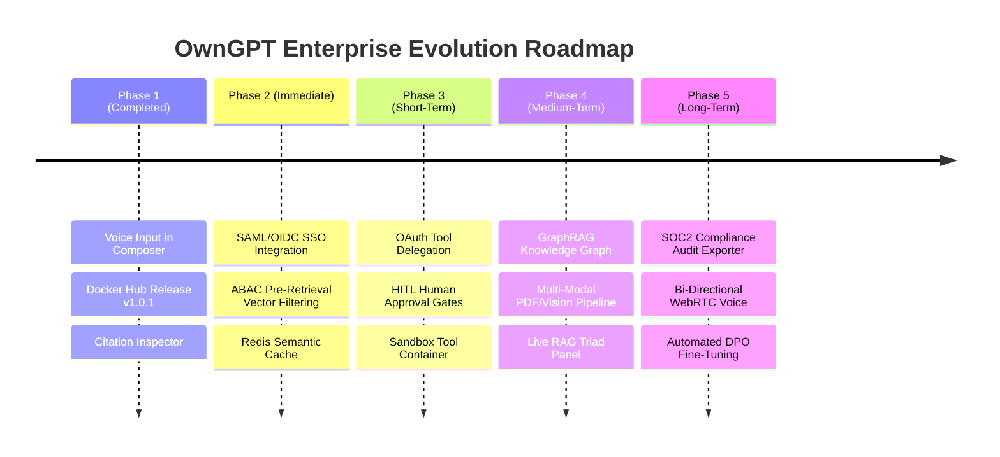

# OwnGPT — Enterprise Platform Upgrade Roadmap

This document defines the comprehensive architecture and feature roadmap for expanding **OwnGPT** into an enterprise-grade AI Engineering and RAG Platform.

---

## 1. Executive Summary & Market Architecture

In 2026, enterprise Retrieval-Augmented Generation (RAG) platforms must satisfy strict requirements across **Data Governance**, **Identity & Access Management (IAM)**, **Agentic Tool Execution**, and **Operational Auditability**.

```
                       +-----------------------------------+
                       |    Enterprise IdP (Okta / OIDC)   |
                       +-----------------------------------+
                                         | (JWT Claims)
                                         v
+------------------+   +-----------------------------------+   +--------------------+
|  Agentic Tool    | < |      OwnGPT Control Plane         | > |   Pre-Retrieval    |
|  Execution &     |   |   (SSO, ABAC, Guardrails, Lineage)|   |   ABAC Filtering   |
|  Sandbox Engine  |   +-----------------------------------+   |   (pgvector / BM25)|
+------------------+                                           +--------------------+
```

---

## 2. Enterprise Identity & User Access Mapping (IAM)

### 2.1 Single Sign-On (SSO) & Identity Propagation
- **Identity Provider (IdP) Integration**: Native support for **SAML 2.0** and **OAuth 2.0 / OpenID Connect (OIDC)** (supporting Azure AD, Okta, Keycloak, PingIdentity).
- **JWT Claim Propagation**: User identity claims (e.g. `sub`, `tenant_id`, `department`, `groups`, `clearance_level`) are attached to every incoming API request and propagated downward through the RAG pipeline.
- **OAuth 2.0 Token Exchange (RFC 8693)**: When an AI agent executes tools on behalf of a user, it requests short-lived scoped tokens using RFC 8693 delegation, ensuring the model never holds elevated global credentials.

### 2.2 Multi-Tenancy & Access Control (RBAC, ABAC, ReBAC)

| Access Level | Model | Mechanism & Enforcement | Example Use Case |
| :--- | :--- | :--- | :--- |
| **Tenant Isolation** | Multi-Tenancy | Namespace / Partition ID in Vector DB (`pgvector`) & SQLite store. | Complete data segregation between orgs or customers. |
| **Role-Based (RBAC)** | Coarse-Grained | System roles: `Admin`, `AI Engineer`, `Operator`, `Auditor`, `Viewer`. | Restricting configuration snapshots or prompt edits to Admins. |
| **Attribute-Based (ABAC)** | Fine-Grained | Pre-Retrieval Vector Filter: `WHERE tenant_id = :t AND read_roles && :user_groups AND clearance <= :user_level`. | Engineering team members cannot retrieve HR compensation files. |
| **Relationship-Based (ReBAC)** | Dynamic | Policy Engine (Open Policy Agent / Cerbos) checking user-to-resource ownership graphs. | Only document owners and their explicit assignees can search private drafts. |

---

## 3. Enterprise Tool Calling & Execution Framework

### 3.1 Dynamic Tool Registry & OAuth Delegation
- **Enterprise Integrations**: Native integrations for Jira, GitHub, Confluence, Slack, Datadog, Salesforce, and PostgreSQL / Snowflake.
- **Per-User Authorization**: Users connect their personal accounts via OAuth 2.0 PKCE. Tools run under the logged-in user's API context rather than a generic bot key.

### 3.2 Security Sandboxing & Human-in-the-Loop (HITL)

```
LLM Tool Request -> Pre-Call Guardrail -> Side-Effect Check -> [HITL Approval if Mutating] -> Sandboxed Execution (WASM/Docker) -> Audit Log
```

1. **Dry-Run & Human Approval Gates**:
   - Read-only tools (`get_issue`, `search_docs`) execute automatically.
   - Side-effect tools (`create_pull_request`, `delete_database`, `trigger_deployment`) pause execution and require explicit UI button approval from an authorized human operator.
2. **Containerized Tool Sandboxing**:
   - Code execution tools (Python interpreter, SQL runner) run inside ephemeral isolated WebAssembly (WASM) or Docker containers with memory limit caps, runtime timeouts (max 10s), and restricted outbound network access.
3. **Tool Rate Limiting & Quota Management**:
   - Per-tool and per-user rate limiters to prevent API quota exhaustion or run-away loop executions.

---

## 4. Advanced Platform Capabilities & UX Enhancements

### 4.1 Frontend & User Experience (UX)

#### 1. Interactive Source Citation Inspector & Split View
- Hovering over inline citation badges (`[1]`, `[2]`) in chat responses highlights the exact sentence in the source text.
- Clicking a source card opens a side-by-side split-view document previewer with target chunk text highlighting.

#### 2. Bi-Directional Streaming Voice & Multimodal Inputs
- Real-time speech-to-text (Web Speech API + OpenAI Whisper API fallback).
- Streaming Text-to-Speech (TTS) response playback with client-side audio visualizer waves.
- Multimodal drag-and-drop support for images, architectural diagrams, PDFs, and spreadsheets.

#### 3. Step-by-Step Agent Execution Inspector
- Collapsible interactive timeline showing real-time agent execution stages (`Intent Classified` → `BM25 & Vector Search` → `Reranker Filter` → `Confidence Calibration` → `Guardrail Validation`).

---

### 4.2 Backend & Retrieval Engine

#### 1. GraphRAG (Knowledge Graph + Hybrid Vector Fusion)
- Combines pgvector dense embeddings and BM25 sparse keyword search with an entity-relationship Knowledge Graph (GraphRAG).
- Enables complex relationship reasoning across multiple system components (e.g. *"Which services depend on Postgres database X and are affected by deployment Y?"*).

#### 2. Semantic Caching & Dynamic Model Routing
- **Semantic Cache**: Query embeddings checked in Redis. Similarity scores `> 0.95` return pre-verified responses instantly, reducing API latency to `<50ms` and cutting LLM token costs by up to 60%.
- **Dynamic Router**: Routes low-complexity queries (summaries, classifications) to fast lightweight models (`gpt-4o-mini`), and high-complexity queries to reasoning models.

#### 3. Self-RAG Iterative Query Reformulation
- If reranker confidence score falls below threshold (`< 0.65`), the agent automatically reformulates the search query and performs a secondary multi-step retrieval pass before answering.

---

### 4.3 Security, Privacy & Governance

#### 1. Prompt Injection & PII Firewall (Guardrails)
- Inbound prompt guardrails detecting jailbreaks, system prompt extraction, and indirect malicious instructions embedded within retrieved documents.
- Automatic PII redactor (redacting credit cards, SSNs, tokens, internal IP addresses) before sending prompts to external LLMs.

#### 2. SOC2 & EU AI Act Compliance Exporter
- One-click export of immutable JSON / PDF audit logs showing full lineage: `User Claim → Raw Prompt → Retrieved Chunks → Security Filter → Model Reasoning → Response`.

---

## 5. Prioritized Implementation Roadmap



---

## 6. Architecture Invariants Check (Constitution Compliance)

All proposed enterprise capabilities preserve the invariants defined in [AGENTS.md](file:///e:/NWCOURSE/High/High-Priority/own_gpt/AGENTS.md):
- **Lifecycle Preserved**: `Observe → Measure → Explain → Propose → Validate → Apply → Operate`
- **Downward Dependency**: Operations & User Management depend on Evidence, Evidence depends on Analytics, Analytics depends on Learning.
- **Immutable Lineage**: Every tool execution, access decision, and vector query generates an append-only `LearningRecord` and `AuditArtifact`.
