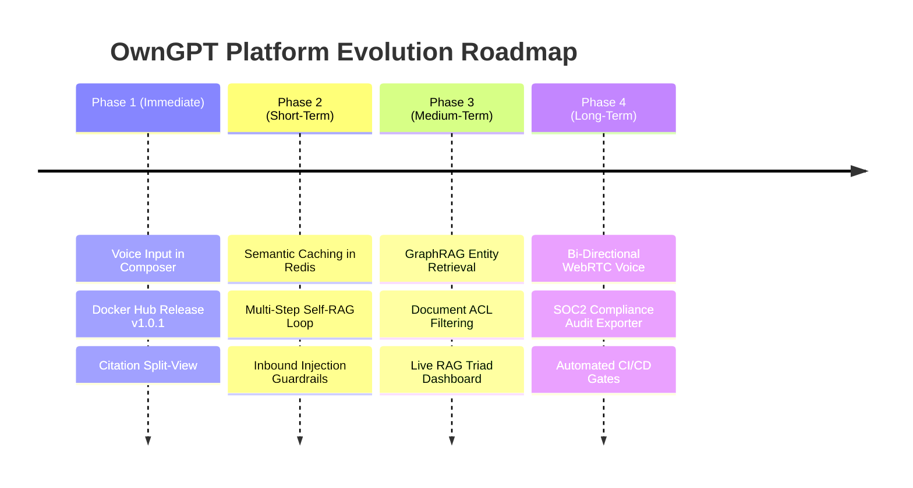

# OwnGPT — Market Analysis & Platform Upgrade Roadmap

This document outlines a market analysis comparing **OwnGPT** against modern enterprise RAG and AI Engineering Platforms (e.g., Cohere Coral, Glean, Dify, LangSmith, AnythingLLM, Open WebUI), along with concrete recommendations for future platform upgrades across Frontend UX, Backend RAG Architecture, Security & Governance, and Operational Intelligence.

---

## 1. Executive Summary & Market Landscape

In the 2026 enterprise landscape, RAG applications have transitioned from naive "vector search + prompt template" setups into **evidence-driven, agentic, evaluation-bound AI engineering platforms**.

Modern benchmark platforms succeed by excelling in 4 core pillars:
1. **User Experience (UX)**: Zero-latency interactive feedback, rich source attribution, inline citation highlighting, voice/multimodal interaction, and split-screen document previewers.
2. **Backend & Retrieval Pipeline**: Hybrid retrieval (Dense Vectors + BM25 Sparse), GraphRAG (Knowledge Graph context), Agentic query planning, cross-encoder reranking, and semantic caching.
3. **Security & Governance**: In-pipeline Attribute-Based Access Control (ABAC), PII redactors, prompt injection firewalls, and immutable lineage auditing.
4. **Continuous Evaluation & Telemetry**: RAG Triad measurement (Context Relevance, Groundedness, Answer Relevance), LLM-as-a-Judge benchmarking, offline counterfactual replay, and automated regression gates.

---

## 2. Recommended Upgrades for OwnGPT

### Pillar A: Frontend & User Experience (UX)

#### 1. Interactive Source Citation Inspector & Split View
- **Current State**: Sources are rendered as text cards in the Evidence Panel.
- **Market Standard**: Hovering over inline citation badges (`[1]`, `[2]`) in the chat bubble highlights the exact sentence in the source document. Clicking a citation opens a side-by-side split-view document viewer with target chunk highlighting.
- **Action Item**: Enhance `MessageBubble.tsx` and `ContextPanel.tsx` with deep-linking chunk highlights (`file://...#L12-L35`).

#### 2. Bi-Directional Voice & Multimodal Workspace
- **Current State**: Web Speech API speech-to-text voice input in `Composer.tsx`.
- **Market Standard**: Bi-directional audio streaming (WebRTC / WebSockets) with real-time text-to-speech (TTS) playback and client-side audio visualizer waves.
- **Action Item**: Add WebSockets audio streaming and optional browser SpeechSynthesis / ElevenLabs / OpenAI TTS voice response toggling in `MessageBubble.tsx`.

#### 3. Inline Thinking & Step-by-Step Reasoner Timeline
- **Current State**: Basic status indicator during streaming.
- **Market Standard**: Collapsible step-by-step agent execution timeline (e.g. `Intent Classified` → `BM25 & Vector Retrieved` → `Reranked Top 5` → `Confidence Calibrated`).
- **Action Item**: Upgrade `GenerationSpinner.tsx` and pipeline stage rendering into an interactive accordion timeline.

---

### Pillar B: Backend & Retrieval Engine

#### 1. GraphRAG (Hybrid Vector + Knowledge Graph Fusion)
- **Current State**: BM25 (Whoosh) + Dense vector retrieval (pgvector).
- **Market Standard**: Combining vector search with entity-relationship Knowledge Graphs (GraphRAG). This allows OwnGPT to answer high-level multi-document analytical questions (e.g., *"How do services X and Y interact across deployments?"*).
- **Action Item**: Integrate lightweight NetworkX / SQLite entity graph index alongside pgvector.

#### 2. Semantic Caching & Model Routing
- **Current State**: Direct execution per request.
- **Market Standard**: 
  - **Semantic Cache**: Store query embeddings in Redis (`REDIS_URL`). If incoming query similarity > 0.95, return cached verified response instantly (reducing cost by up to 60% and latency to <50ms).
  - **Dynamic Model Router**: Use fast, cheap models (e.g. `gpt-4o-mini` or local LLM) for intent classification and query rewriting, reserving larger reasoning models for generation.
- **Action Item**: Implement `SemanticCache` middleware in `app/agent/pipeline/`.

#### 3. Agentic Multi-Step Iterative Retrieval (Self-RAG)
- **Current State**: Single pass classification → retrieval → rerank → generation.
- **Market Standard**: Self-RAG agent loop: if reranker confidence score is below threshold (e.g. `< 0.65`), the agent automatically reformulates the search query and performs a secondary retrieval pass before answering.
- **Action Item**: Implement query reformulation loop in `app/agent/pipeline/pipeline.py`.

---

### Pillar C: Security, Privacy & Governance

#### 1. Document-Level Access Control (ACL / ABAC)
- **Current State**: Global retrieval across all indexed documents.
- **Market Standard**: In-retrieval filtering based on user roles and document permissions (ABAC). Vectors and BM25 docs contain `read_roles` metadata (`['admin', 'engineering']`).
- **Action Item**: Add role metadata filtering in `app/retrievers/hybrid.py` and `app/services/pgvector.py`.

#### 2. Prompt Injection & PII Firewall (Guardrails)
- **Current State**: Basic PII sanitization.
- **Market Standard**: Inbound prompt guardrails (detecting indirect prompt injections, jailbreaks, system prompt extraction attempts) and outbound hallucination guards.
- **Action Item**: Add input/output guardrail checks in `app/agent/pipeline/validation.py`.

#### 3. Lineage Export & Compliance Reporting
- **Current State**: LearningLedger and ConfigurationSnapshot stored internally.
- **Market Standard**: One-click PDF/JSON audit log export for compliance (EU AI Act, SOC2) showing complete lineage: `Query → Retrieved Chunks → Confidence Score → Evaluated Output`.
- **Action Item**: Expose `/api/v1/operations/audit/export` endpoint.

---

### Pillar D: Operational Intelligence & Continuous Evaluation

#### 1. RAG Triad Real-Time Monitoring Panel
- **Current State**: Offline RAGAS benchmark runner.
- **Market Standard**: Live monitoring dashboard measuring the RAG Triad (**Context Relevance**, **Groundedness**, **Answer Relevance**) for every user interaction.
- **Action Item**: Surface live RAG Triad scores in `DashboardPage.tsx` and `PerformanceMetrics.tsx`.

#### 2. Automated Regression Gates in CI/CD
- **Current State**: Manual benchmark trigger script.
- **Market Standard**: GitHub Actions gate that automatically runs benchmark tests on pull requests and blocks deployment if groundedness or retrieval recall drops below baseline.
- **Action Item**: Connect `k8s/` manifests and `.github/workflows/rag-benchmark.yml` with strict gate policies.

---

## 3. Prioritized Implementation Roadmap

---

## 4. Conclusion & Next Steps

OwnGPT is already exceptionally architected with its 10-pillar structure and constitution (`AGENTS.md`). Implementing these recommendations will elevate OwnGPT to a top-tier, enterprise-grade AI Engineering Platform.
